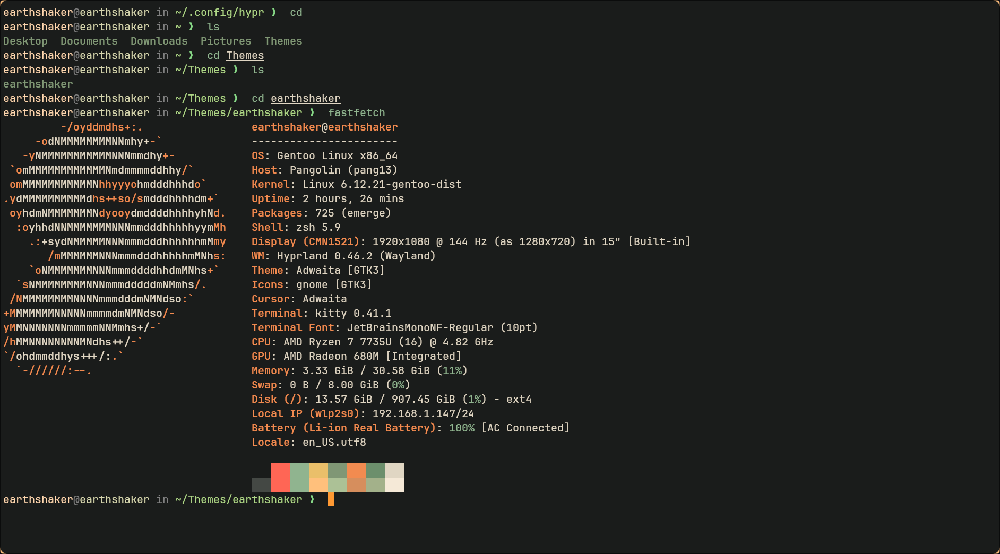

# 🌑 earthshaker.kitty

**A calm, resilient, earthy color scheme for Kitty terminal users who walk barefoot on the code-strewn forest floor.**

> Part of the [Earthshaker Theme Suite](https://github.com/remusearthshaker) by [Remus Alexander](https://github.com/remusearthshaker)  
> Powered by moss, bark, wildflower, and the deep blacksoil beneath your feet.

---

## 📸 Preview



---

## 🌿 Philosophy

Earthshaker is more than a theme — it's a **mindset**.

This palette is built to:

- **Reduce eye strain** through deep forest hues and low-acid contrast
- **Honor natural balance** through warm highlights and weathered neutrals
- **Center your focus** with clarity, silence, and deliberate color choices

Every color in Earthshaker is drawn from a palette of *living stone, soft shadow, and late-autumn foliage*.

---

## 🎨 Core Colors

| Role              | Hex       | Name           |
|-------------------|-----------|----------------|
| Background        | `#181816` | deepforestfloor |
| Foreground        | `#e0d6c3` | sunlight        |
| Cursor            | `#ffc07c` | wildflower      |
| Selection         | `#3a3938` | overlay_barkshadow |
| Comment Accent    | `#7c8474` | moss            |
| Keyword Highlight | `#ff6655` | berrythorn      |
| Function Accent   | `#ffc07c` | wildflower      |
| String Highlight  | `#eabf6a` | pollen          |

---

## 📦 Installation

### Manually

1. Clone the repo:

   ```bash
   git clone https://github.com/remusearthshaker/earthshaker.kitty

2. Link the theme in your kitty.conf

  ```bash
  include earthshaker.conf

  ```

## 💠 Part of a Larger Ecosystem

Explore the full Earthshaker theme suite:

[earthshaker.zsh](https://github.com/remusearthshaker/earthshaker.zsh)

[earthshaker.nvim](https://github.com/remusearthshaker/earthshaker.nvim)

[earthshaker.sway](https://github.com/remusearthshaker/earthshaker.sway)

## 📜 License

MIT License © 2025 Remus Alexander
